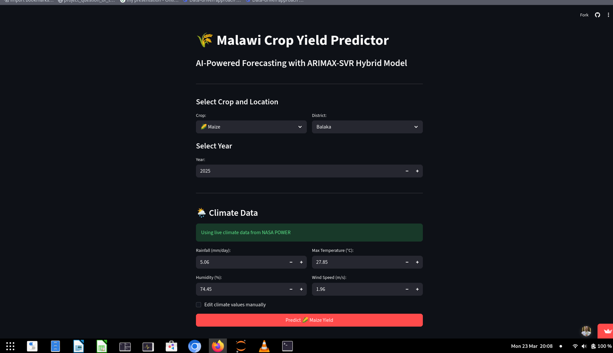

# 🌾 Malawi Crop Yield Predictor

AI-powered crop yield prediction for Malawi using ARIMAX-SVR hybrid model.

## 📊 Features
- 🌽 **4 Crops**: Maize, Rice, Soybean, Groundnuts
- 📍 **28 Districts**: Full coverage of Malawi
- 🌦️ **Real-time Climate**: NASA POWER API integration
- 🤖 **ARIMAX-SVR**: Hybrid time series + machine learning model
- 📈 **R² up to 0.5835** for maize predictions

## 🚀 Live Demo
[Click here to try the app](https://yield-predictor.streamlit.app)

## 📸 Screenshot

## 🔧 Model Performance
| Crop | R² | RMSE (kg/ha) |
|------|-----|--------------|
| Maize | 0.5835 | 519 |
| Rice | 0.4394 | 568 |
| Soybean | 0.2761 | 380 |
| Groundnuts | 0.2633 | 367 |

## 📁 Data Sources
- **Climate Data**: NASA POWER API
- **Yield Data**: HarvestStat Africa (1983-2023)

## 🛠️ Tech Stack
- Streamlit
- Python
- ARIMAX-SVR
- Pandas, NumPy, Scikit-learn

## 📧 Contact
Patrick John - [GitHub](https://github.com/patrickjohnludbot)

## 📄 License
MIT
